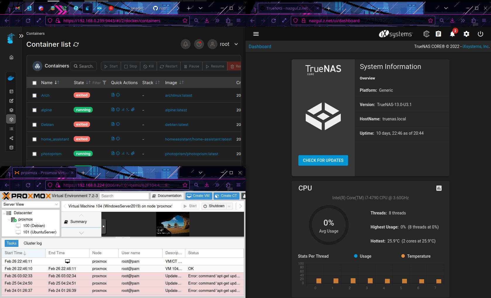

Nathaniel Zagrabelny's Portfolio

Hello my name is Nathaniel Zagrabelny, I am a Technology enthusiast and IT support specialist receiving an education in networking and cybersecurity. Working as an IT Help Desk technician at Lake Superior College. I'm on my fourth semester at Lake superior College working on my Network Admin and Cybersecurity degree.
 
 

Experience

IT Help Desk Support

Lake Superior College | August 2021 - Present

- Assisting Students with account creation and password problems.

- Infrastructure building, Including LAN setup, Software implementation & Hardware setup.

- Assisting The Network Admin with regular duties / maintenance.

- Used the deployment servers to administer software patches across campus.

- Customer service skills, including completing support tickets, and handling student problems over the phone.

Professional Education

AAS in Network Administration, Cybersecurity

Lake Superior College at Duluth | August 2021 - Present

Currently studying at a community college to jump start my career in IT

Graduating in May 2023 with a degree in Networking & Cybersecurity.

Extra Curricular Activities

<b>
Home lab:
</b>
 
 

 
 

-PROXMOX Virtual Machine server

-TrueNAS implementation

-pfsense router

-Self hosted Nextcloud

-Zoneminder security camera

-Jellyfin media server

-Portainer box

<b>
Cybersecurity Club:
</b>
 
 
-Ranked in the top 20% of teams for Hivestorm 2022

-Vulnerability scanning on test machines for the competition.

<b>
Academic Accomplishments:
</b>
 
 

-Deans List Fall 2021

-Deans List Spring 2022 

<b>
Prior Coursework includes:
</b>
 
   
A+ Operating Sys Tech 

A+ Core Hardware

Windows Client Admin 

CISCO Networking I   

Foundations of CIS 

Computer User Support

UNIX System Admin

CISCO Networking II 

Windows Server Admin 

Security Fundamentals 

Web Server Administration 

Intrusion Detection  

Forensics & Incident   

Network Security

 
 
<b>
Proficient in both Linux/Unix based operating systems and in WindowsNT operating systems.
</b>
